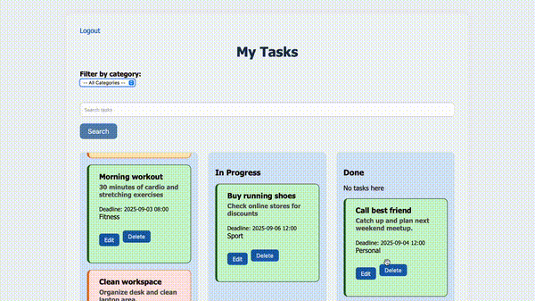

# Symfony ToDo App
A task management web application built with **Symfony**.  
This project offers user-friendly features including registration, login, email verification, password reset, and task management. Users can create, edit, categorize, filter, and reorder their tasks with drag & drop support. Overdue tasks are highlighted visually, and a statistics page provides an overview of task statuses.


**Key Features:**
* User registration & login
* Email verification (unverified users cannot log in)
* Password reset functionality
* Create, edit, and delete tasks
* Task categorization (default & custom categories per user)
* Task filtering by category
* Deadline highlighting – overdue tasks are visually marked
* Drag & drop task reordering between statuses (To Do, In Progress, Done)
* Statistics page with task status diagram

**Backend:**
- PHP 8.2+
- Symfony 7.3 
- Doctrine ORM + Migrations
- SymfonyCasts ResetPasswordBundle
- SymfonyCasts VerifyEmailBundle
- Symfony Mailer
- Docker / Docker Compose
- PHPUnit

**Frontend:**
- HTML5, CSS3, JavaScript
- Twig templating engine
- SortableJS (for drag & drop functionality)
- Flatpickr (date picker)
- Custom CSS styles

**Database:**
- MySQL

**Environment & Tools:**
- Docker (for local development)
- MailHog (for testing email functionality)

**Running the Project**
1. Make sure you have Docker and Docker Compose installed.
2. Clone the repository
3. Build and start the Docker containers
```bash
docker compose up -d --build
```
4. Create the database and run migrations:
```bash
docker compose exec php php bin/console doctrine:database:create
docker compose exec php php bin/console doctrine:migrations:migrate
```
5. Visit: http://localhost:8080
6. All emails sent by the application can be viewed through the Mailer web interface at http://localhost:8025.

**Testing**
Run PHPUnit tests:
```bash
docker compose exec php php bin/phpunit

```

**Planned Features**:
- Notifications for upcoming deadlines  
- Task comments
- API for mobile app integration  
- Dark mode theme

